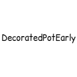

# DecoratedPotEarly

  
这是一个将 **``Minecraft 1.21.4 陶罐(Decorated Pot)``**  尽可能移植到 **``Minecraft 1.20.1``** 的模组，将陶罐部分新特性带回 **``Minecraft 1.20.1``** 。  
因为 mod 使用了原版名称空间和数据格式，所以可以与 Litematica Mod 读取的高版本投影内的陶罐兼容，同时升级存档也能被高版本识别并保留。

## 说明
这个项目通过参考1.21.4源代码，并根据低版本对应情况修改而来，通过大量的mixin来让陶罐获得高版本特性。

**进行移植的部分：**
- 新增物品存储功能
- 新增方块动画
- 新增粒子效果
- 新增交互音频
- 新增音频文本
- 修改堆叠为64个
- 修复无纹样陶罐使用后产生额外nbt导致不可堆叠的问题
- 修复有纹样陶罐使用后nbt部分丢失导致不可堆叠的问题
- 加入陶罐至创造模式物品栏的“红石方块”类别
- 可以使用选取方块键选取陶罐并获取正确的样式
- 如果cracked方块状态设置为true，无论使用何种方式破坏饰纹陶罐，饰纹陶罐都会碎裂

**没有移植的部分：**
- 饰纹陶罐会被弹射物击毁 (此特性属于副作用，且高版本中该行为绑定了一个新的游戏规则，不予移植)
- 陶罐可使用战利品表，并且会从其LootTableNBT标签中读取 (陶罐不会在当前版本的世界中主动生成，战利品表无意义，不予移植)
- 无纹样的饰纹陶罐会生成于试炼密室 (不存在试炼密室结构，不予移植)
- 更改之后的饰纹陶罐的碎裂音效 (不影响功能，不予移植)
- 更改之后的饰纹陶罐的破坏音效 (不影响功能，不予移植)
- 更改之后的饰纹陶罐的被踩踏音效 (不影响功能，不予移植)

## 环境要求
**游戏版本**：**``Minecraft 1.20.1``**  
**加载器版本**：**``Fabric 0.16.10+``**  
**Fabric API**: **``0.92.3+``** （自0.92.3版本起，修复了一个可能导致此模组出现问题的bug）  
**多人游戏**：**``服务端``** 与 **``客户端``** 均必须安装  
**单人游戏**：仅需 **``客户端``** 安装

## 注意
- 如果仅在服务器安装而客户端未安装，连接此服务器时会出现 **"模组缺失"** 或 **"方块ID无法解析"** 等问题。
- 如果仅在客户端安装，**可以正常进入未安装此 Mod 的服务器** （在此服务器中客户端 Mod 方块不生效）。

## Star History

